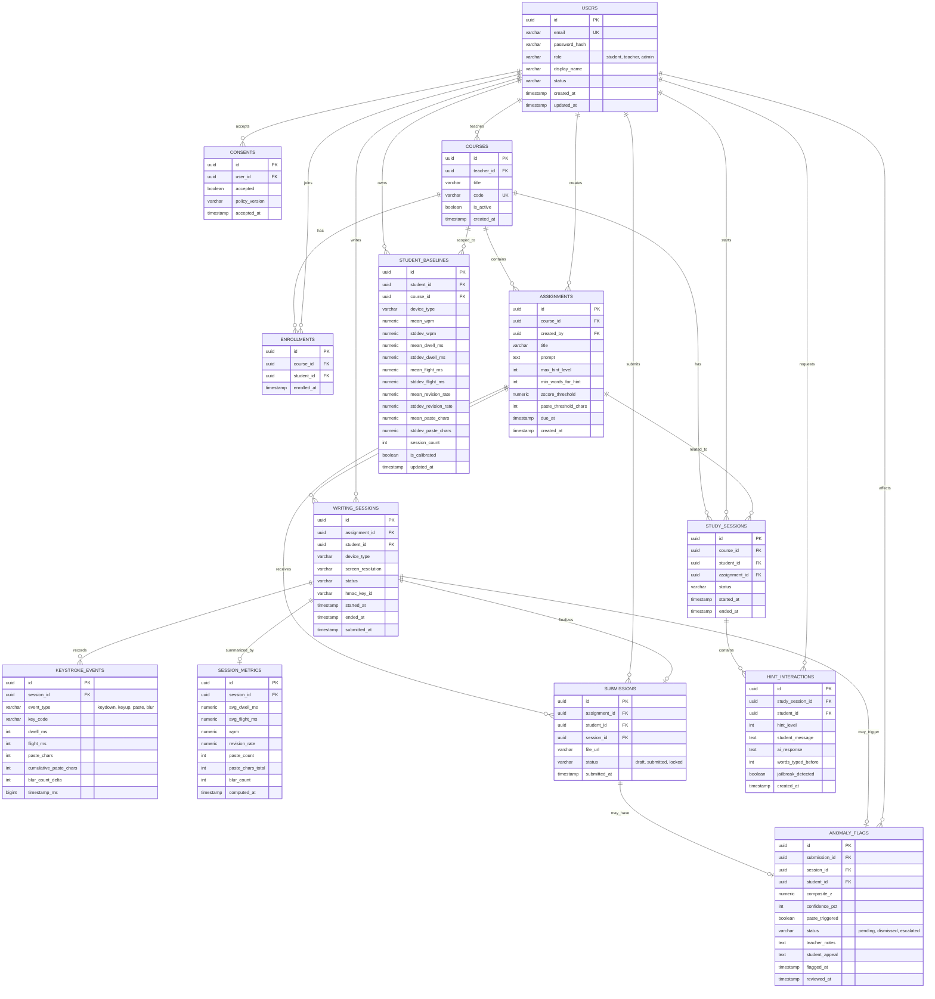

# Guardrail LMS ERD

This is a report-ready MVP ERD for the standalone student-project version of Guardrail LMS.

It keeps only the core features:
- user roles
- courses and enrollments
- assignments and submissions
- monitored writing sessions and keystroke telemetry
- session metrics, baselines, and anomaly flags
- study sessions and Socratic hint logs

It intentionally leaves out more advanced production entities such as policy version tables, audit logs, deletion requests, and prompt version management.

## Why This Version Fits The Project

- It is small enough to implement in a month.
- It still covers the unique Guardrail features instead of becoming a generic LMS.
- It avoids overengineering tables that are useful in production but not essential for a student prototype.

## Main Entity Groups

- Core LMS: `USERS`, `COURSES`, `ENROLLMENTS`, `ASSIGNMENTS`, `SUBMISSIONS`
- Integrity Monitor: `WRITING_SESSIONS`, `KEYSTROKE_EVENTS`, `SESSION_METRICS`, `STUDENT_BASELINES`, `ANOMALY_FLAGS`
- Socratic Tutor: `STUDY_SESSIONS`, `HINT_INTERACTIONS`
- Consent: `CONSENTS`

## Entities Intentionally Removed For Now

- `CONSENT_POLICY_VERSIONS`
- `USER_CONSENTS` as a separate versioned consent history model
- `FLAG_METRIC_BREAKDOWNS`
- `FLAG_APPEALS` as a separate workflow table
- `PROMPT_VERSIONS`
- `DELETION_REQUESTS`
- `AUDIT_LOGS`

## Notes

- `KEYSTROKE_EVENTS` is still the largest table and should be treated as the high-volume telemetry table.
- `STUDENT_BASELINES` should be unique by `student_id`, `course_id`, and `device_type`.
- `SUBMISSIONS` stores only the file location, not the raw file content.
- If your scope gets tighter, the first optional cut should be `student_appeal` workflow detail, not the telemetry core.
