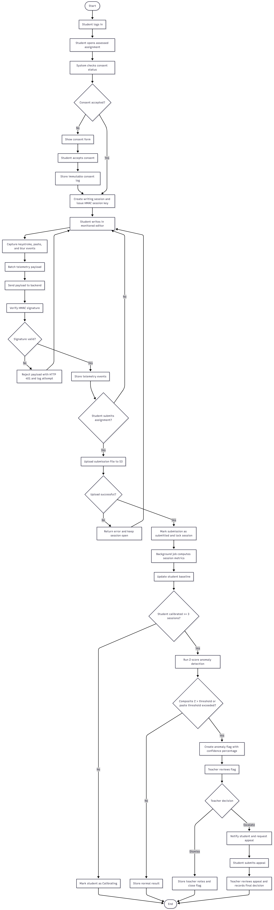
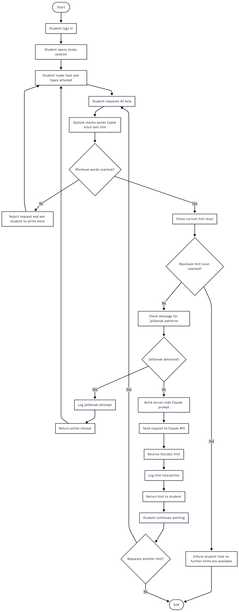

# Requirement Analysis & Design

Respondent: AUNG KHANT PAING
Submission time: March 21, 2026 12:14 AM

**GUARDRAIL LMS**

# Process-Based Academic Integrity & Socratic AI Tutor

Software Requirements Analysis Report

# 1. Introduction

## 1.1 Purpose of this Document

This Software Requirements Analysis Report defines the complete functional and non-functional requirements for Guardrail LMS, a web-based learning management system designed for the Academic Session 2026. The document identifies system actors, use cases, functional requirements (using MoSCoW prioritisation), non-functional requirements, and system constraints. It serves as the authoritative reference for development, testing, and academic evaluation.

## 1.2 Project Background

The rise of generative AI tools has created significant challenges in educational environments. Students can obtain complete answers from AI tools with minimal effort, traditional AI detection methods carry high false-positive rates, and binary approaches (ban AI entirely or allow it unrestricted) fail to address the underlying pedagogical problem.

Guardrail LMS addresses these challenges through two distinct subsystems that share a common technical foundation:

Subsystem 1 — Integrity Monitor: detects AI-assisted writing during assessed tasks through behavioural biometrics (keystroke dynamics) and statistical anomaly detection. No AI is involved in the writing phase itself; the AI is what the system detects against.

---

Subsystem 2 — Socratic Tutor: provides guided AI assistance during learning sessions. The AI never gives direct answers; it scaffolds student thinking through a progressive hint hierarchy (L1 Nudge → L2 Scaffold → L3 Guided).

---

## 1.3 Scope

This project includes a functional prototype covering: monitored text assignment editor, behavioural telemetry pipeline, Z-score anomaly detection engine, Socratic AI tutor with jailbreak resistance, teacher analytics dashboard, and student transparency dashboard. It does not include video proctoring, biometric authentication, AI content detection, mobile applications, or a full-featured LMS competing with Canvas or Moodle.

## 1.4 Definitions & Abbreviations

| **Term** | **Definition** |
| --- | --- |
| **KSD** | Keystroke Dynamics — the study of typing rhythm including dwell time (key hold duration) and flight time (gap between keys) |
| **Dwell Time** | The duration between a key-press (keydown) and key-release (keyup) event for a single keystroke |
| **Flight Time** | The time elapsed between the keyup of one key and the keydown of the next key |
| **Z-Score** | A statistical measure of how many standard deviations a value is from the mean: Z = |x − μ| ÷ σ |
| **Baseline** | A student’s established normal typing profile (mean and standard deviation of each metric) built over 3+ sessions |
| **Calibration Phase** | The first 3 sessions for a student on a given device, during which baselines are built silently without anomaly detection |
| **HMAC-SHA256** | Hash-based Message Authentication Code — used to cryptographically sign telemetry payloads to prevent spoofing |
| **Socratic Method** | An educational technique using guided questioning to lead students toward understanding rather than providing direct answers |
| **MoSCoW** | Prioritisation framework: Must have, Should have, Could have, Won’t have (this version) |
| **MVCC** | Multi-Version Concurrency Control — PostgreSQL’s concurrency model enabling concurrent reads without blocking writes |
| **S3** | Amazon Simple Storage Service — cloud object storage used for submission content files |

# 2. System Overview

## 2.1 The Problem

Educational institutions face three converging challenges with the emergence of generative AI. First, students can obtain complete, high-quality written responses from tools such as ChatGPT or Claude in seconds, making traditional take-home assignments trivially bypassable. Second, AI content detectors have demonstrated false-positive rates that can unfairly penalise legitimate student work, particularly for non-native English speakers. Third, most institutional responses are binary — either prohibit AI entirely (unenforceable) or allow unrestricted use (defeats the purpose of assessment).

## 2.2 The Solution

Guardrail LMS takes a process-based approach. Rather than analysing the content of a submission for AI patterns, it analyses the behaviour of the student during composition. A student who genuinely wrote their own work will exhibit consistent typing rhythms, natural revision patterns, and progressive drafting behaviour that matches their established baseline. A student who pasted AI-generated text will exhibit an abrupt change in those signals regardless of how the content reads.

Simultaneously, the system provides a structured AI learning tool during non-assessed study sessions, teaching students how to use AI productively as a thinking partner rather than as a shortcut.

## 2.3 Two-Subsystem Architecture

| **Subsystem 1: Integrity Monitor** | **Subsystem 2: Socratic Tutor** |
| --- | --- |
| Triggered by assessed tasks (assignments, classwork) | Triggered by study / practice sessions |
| AI is what the system detects against — no AI during writing | AI is the central tool — Claude API powers guided hints |
| Student writes in monitored editor silently | Student actively asks AI for help at any time |
| Output: anomaly flag with Z-scores and confidence % | Output: scaffolded hint at L1 / L2 / L3 level |
| Teacher reviews flags; no automated academic action | Hint usage logged; teacher can see patterns |
| Keystroke telemetry, HMAC signing, Z-score engine | Effort gate, hint hierarchy, jailbreak detection |

# 3. Actors & Stakeholders

## 3.1 Actor Overview

The following actors interact with or are served by Guardrail LMS. Primary actors directly initiate use cases. Secondary actors support system operation. External actors are third-party systems the LMS integrates with.

| **Actor** | **Type** | **Description** | **Key Interactions** |
| --- | --- | --- | --- |
| **Student** | **Primary** | Writes assignments in the monitored editor, uses the Socratic tutor during study sessions, views their own behavioural dashboard, and submits appeals for flagged sessions. | UC-S1 through UC-S7 |
| **Teacher / Instructor** | **Primary** | Creates and manages courses and assignments, reviews anomaly flags with full context, takes intervention actions, monitors class-level analytics and hint usage patterns. | UC-T1 through UC-T7 |
| **Admin** | **Secondary** | Manages user accounts and roles, configures system-wide Z-score thresholds, manages consent policy versions, and exports data for compliance audits. | UC-A1 through UC-A3 |
| **Claude API** | **External** | Large Language Model backend powering the Socratic tutor. Receives system-prompted requests with strict anti-answer instructions, returns guided hints, detects jailbreak patterns. | UC-S3, UC-SYS5 |
| **S3 File Storage** | **External** | Cloud object storage for submission content files. Receives uploads from the backend at submission time, returns pre-signed URLs for teacher review. | UC-S4, UC-T3 |
| **Background Jobs** | **Secondary** | Automated processes that compute session metrics, recalculate student baselines via UPSERT, run the Z-score anomaly engine, and rotate keystroke_events partitions weekly. | UC-SYS1 through UC-SYS7 |
| **Redis Cache** | **External** | In-memory store for JWT session state (with TTL), rate-limit counters, and the calibration phase state cache. Provides sub-millisecond token validation on every API request. | All authenticated routes |

# 4. Use Cases

## 4.1 Student Use Cases

| **UC ID** | **Use Case** | **Actor** | **Description** |
| --- | --- | --- | --- |
| **UC-S1** | **Register & consent** | Student | Student creates an account and accepts the monitoring consent form before any telemetry is collected. Consent record is immutable and versioned. |
| **UC-S2** | **Write assignment** | Student | Student opens an assessed assignment and types in the monitored editor. Keystroke telemetry is captured silently without disrupting the writing experience. |
| **UC-S3** | **Request a hint** | Student | During a study session, student requests AI guidance. System checks effort gate (word count), then calls Claude API for a Socratic hint at the appropriate level. |
| **UC-S4** | **Submit assignment** | Student | Student finalises their draft. Content is uploaded to S3 first, then submission status changes to submitted and the session is locked. |
| **UC-S5** | **View own dashboard** | Student | Student views their personal transparency dashboard showing typing speed trends, hint usage history, calibration status, and any flags raised against them. |
| **UC-S6** | **Appeal a flag** | Student | If a session is flagged and escalated, student submits a written explanation. This is stored and presented to the teacher during their review. |
| **UC-S7** | **Request data deletion** | Student | After course completion, student can request deletion of their raw telemetry data. Consent logs are retained separately as a legal record. |

## 4.2 Teacher Use Cases

| **UC ID** | **Use Case** | **Actor** | **Description** |
| --- | --- | --- | --- |
| **UC-T1** | **Create course & assignment** | Teacher | Teacher sets up a course, adds students via enrollment, and creates assignments specifying the prompt, due date, maximum hint level, and minimum word threshold for hints. |
| **UC-T2** | **View class dashboard** | Teacher | Teacher sees an overview of all students in a course: submission statuses, pending flag count, hint usage rates, and calibration progress per student. |
| **UC-T3** | **Investigate a flag** | Teacher | Teacher drills into a specific anomaly flag to see the full context: per-metric Z-scores, confidence percentage, paste events timeline, blur events, and submission content. |
| **UC-T4** | **Review & action flag** | Teacher | Teacher takes an action on a pending flag: dismiss with notes, or escalate to the academic integrity committee. The system records the decision and timestamp. |
| **UC-T5** | **Read student appeal** | Teacher | When reviewing an escalated flag, teacher sees the student’s written appeal alongside the session evidence side by side. |
| **UC-T6** | **Export report** | Teacher | Teacher exports a per-student or class-level integrity report as PDF or CSV for submission to academic integrity committees. |
| **UC-T7** | **Configure thresholds** | Teacher | Teacher adjusts the Z-score flag threshold and paste size threshold for a specific assignment to account for known variables (e.g. open-book assessment). |

## 4.3 Admin Use Cases

Admin users are responsible for platform-level governance. They do not interact with individual assignments or flags directly, but configure the rules and policies the system enforces, manage all user accounts, and ensure compliance with institutional data protection requirements.

| **UC ID** | **Use Case** | **Actor** | **Description** |
| --- | --- | --- | --- |
| **UC-A1** | **Manage user accounts** | Admin | Admin creates, deactivates, or changes the role of any user account. Admin cannot delete accounts that have associated consent logs (enforced at DB level with ON DELETE RESTRICT). |
| **UC-A2** | **Enroll students in bulk** | Admin | Admin uploads a CSV of student-course enrollments to onboard an entire cohort at once, reducing manual teacher setup burden at the start of a semester. |
| **UC-A3** | **Configure global Z-score threshold** | Admin | Admin sets the system-wide default Z-score flag threshold (default: Z > 3) and the default paste volume threshold. Teachers may override these per assignment within admin-defined bounds. |
| **UC-A4** | **Manage consent policy versions** | Admin | Admin publishes a new version of the monitoring consent form. Students who have not accepted the new version are prompted to re-consent before their next session begins. |
| **UC-A5** | **Export compliance audit data** | Admin | Admin exports consent logs, flag history, and data deletion requests as a structured report for institutional data protection officers or external auditors. |
| **UC-A6** | **Process data deletion requests** | Admin | Admin reviews and executes approved student data deletion requests, purging raw telemetry from keystroke_events and session_metrics while retaining consent logs as required by policy. |
| **UC-A7** | **Monitor system health** | Admin | Admin views system-level metrics: API error rates, background job queue depth, partition table status, Redis hit rate, and Claude API usage and cost. |
| **UC-A8** | **Update Socratic system prompt** | Admin | Admin edits and deploys the server-side Claude API system prompt governing Socratic tutor behaviour. Changes are versioned and logged. The prompt is never exposed to students or teachers. |

## 4.4 System Use Cases

| **UC ID** | **Use Case** | **Actor** | **Description** |
| --- | --- | --- | --- |
| **UC-SYS1** | **Verify HMAC payload** | System | Backend verifies the HMAC-SHA256 signature of every incoming telemetry payload. Unsigned or tampered payloads are rejected with HTTP 401 and logged. |
| **UC-SYS2** | **Aggregate session metrics** | System | Background job computes WPM, average dwell time, average flight time, revision rate, paste count, and blur count from raw events at session end. |
| **UC-SYS3** | **Update student baseline** | System | After each session, UPSERT the student’s baseline record with recalculated mean and standard deviation. Increment session_count. Set is_calibrated = TRUE when count reaches 3. |
| **UC-SYS4** | **Run anomaly detection** | System | For calibrated students only, compute per-metric Z-scores and the weighted composite score. Write ANOMALY_FLAG if Z > 3 or if cumulative paste volume exceeds threshold. |
| **UC-SYS5** | **Detect jailbreak attempt** | System | Before returning any Claude API response, check the student’s message for known jailbreak patterns. Log attempt with jailbreak_detected = TRUE and return a polite refusal. |
| **UC-SYS6** | **Rotate partitions** | System | Scheduled job creates the next week’s keystroke_events partition before the current week’s boundary is reached, ensuring no write gaps in the partitioned table. |
| **UC-SYS7** | **Enforce calibration gate** | System | Z-score engine checks is_calibrated before running. If FALSE, baseline is updated silently and the student’s dashboard shows a Calibrating indicator. |

# 5. Functional Requirements

Requirements are prioritised using the MoSCoW framework. Must requirements are non-negotiable for the prototype; failure to deliver them constitutes an incomplete submission. Should requirements are important but can be deferred if time is critical. Could requirements are enhancements for polish weeks.

## 5.1 Subsystem 1: Integrity Monitor

| **ID** | **Requirement** | **Priority** | **Linked UC** |
| --- | --- | --- | --- |
| **FR-01** | System must support role-based user registration (student / teacher / admin) with JWT authentication and bcrypt password hashing (cost factor ≥ 12). | **Must** | UC-S1, UC-T1 |
| **FR-02** | Student must accept a versioned monitoring consent form before any telemetry is collected. The consent record must be immutable and retained even if the user account is deleted. | **Must** | UC-S1 |
| **FR-03** | The text editor must capture dwell time, flight time, paste events (with character count and cumulative total), and window blur events in real time without disrupting the student’s typing flow. | **Must** | UC-S2 |
| **FR-04** | All telemetry payloads must be HMAC-SHA256 signed using a session-specific key. The backend must reject unsigned or invalid payloads with HTTP 401 and log the attempt. | **Must** | UC-SYS1 |
| **FR-05** | Session metrics (WPM, average dwell, average flight time, revision rate, paste count, blur count) must be computed by a background job and stored in SESSION_METRICS at session end. | **Must** | UC-SYS2 |
| **FR-06** | Baselines must be maintained per student, per course, per device type. The system must not flag anomalies until a student has ≥ 3 completed sessions. The dashboard must show a Calibrating badge until this threshold is met. | **Must** | UC-SYS3, UC-SYS7 |
| **FR-07** | Z-score must be computed per metric using the formula Z = |x − μ| ÷ σ. Composite score weighting: WPM 40%, paste events 35%, revision rate 25%. Flag must be raised when composite Z > 3. | **Must** | UC-SYS4 |
| **FR-08** | Anomaly flags must include a confidence percentage (0–100%). The system must never display binary guilty/innocent verdicts. All flags must require manual teacher review before any action is taken. | **Must** | UC-T3, UC-T4 |
| **FR-09** | Large paste events (cumulative pasted characters exceeding a configurable threshold per session) must trigger a flag independently of the Z-score engine. | **Must** | UC-SYS4 |
| **FR-10** | Teacher dashboard must show: class overview with pending flag count, per-student drill-down with full Z-score breakdown, flag detail view with paste event timeline, and intervention action buttons (dismiss / escalate). | **Must** | UC-T2, UC-T3, UC-T4 |
| **FR-11** | Student transparency dashboard must display all data collected about the individual student: typing speed trend, hint usage history, calibration status, and any flags raised. No other student’s data may be visible. | **Must** | UC-S5 |
| **FR-12** | Flagged students must be able to submit a written appeal. The teacher’s review interface must display the appeal text alongside the session data side by side. | **Must** | UC-S6, UC-T5 |
| **FR-13** | Submission content must be stored in S3. The database stores only the file URL. The S3 upload must succeed before submission status transitions to submitted. | **Should** | UC-S4 |
| **FR-14** | Teacher must be able to export a per-student or per-class integrity report as PDF or CSV for submission to academic integrity committees. | **Should** | UC-T6 |
| **FR-15** | Student must be able to request deletion of their raw telemetry data after course completion. Consent logs must be retained as a legal record regardless. | **Should** | UC-S7 |
| **FR-16** | keystroke_events table must be partitioned by timestamp_ms on a weekly schedule. A background job must create the next partition before the current week’s boundary is reached. | **Should** | UC-SYS6 |
| **FR-17** | Rate limiting on the login endpoint: maximum 10 failed attempts per 15-minute window per IP, enforced via Redis counter. | **Could** | FR-01 |
| **FR-18** | Teacher could receive an in-app notification when a new high-confidence flag (≥ 80%) is raised against a student in their class. | **Could** | UC-T2 |

## 5.2 Subsystem 2: Socratic Tutor

| **ID** | **Requirement** | **Priority** | **Linked UC** |
| --- | --- | --- | --- |
| **FR-19** | The AI tutor must never return a direct answer, a full outline, or complete code to the student. The system prompt must explicitly forbid this, and the instruction must be hardcoded server-side. | **Must** | UC-S3 |
| **FR-20** | Hints must progress through three levels: L1 (broad conceptual nudge), L2 (structural scaffold — sub-steps without answers), L3 (near-answer guided example — student completes the last step). Hint level may only advance if the student has typed ≥ min_words_for_hint since the last hint. | **Must** | UC-S3 |
| **FR-21** | The effort gate (word count check) must be enforced server-side before any call is made to the Claude API. Client-side enforcement alone is insufficient. | **Must** | UC-S3, UC-SYS5 |
| **FR-22** | The system must detect jailbreak attempts in the student’s message before passing it to the Claude API. Detected attempts must be logged with jailbreak_detected = TRUE and refused gracefully. The system prompt must not be revealed. | **Must** | UC-SYS5 |
| **FR-23** | Every hint interaction must record: hint level, student message, AI response, jailbreak detected flag, and words typed before the request. This log must be visible to the teacher on the class dashboard. | **Must** | UC-S3, UC-T2 |
| **FR-24** | When the maximum hint level is reached for a session, the tutor must inform the student that no further hints are available and suggest consulting the teacher or course materials. | **Should** | UC-S3 |
| **FR-25** | The system prompt must be stress-tested against a minimum of 10 known jailbreak patterns before deployment. Test results must be documented. | **Should** | UC-SYS5 |
| **FR-26** | The tutor could maintain a separate conversation context per topic or sub-question within a study session, allowing the student to switch topics without carrying over a maxed-out hint level. | **Could** | UC-S3 |

# 6. Non-Functional Requirements

| **ID** | **Category** | **Requirement** |
| --- | --- | --- |
| **NFR-P1** | **Performance** | Telemetry batch write must complete in < 200ms at p95 latency under 50 concurrent active students. |
| **NFR-P2** | **Performance** | Teacher dashboard must load within 1 second for a class of 60 students on a standard broadband connection. |
| **NFR-P3** | **Performance** | Z-score computation and baseline UPSERT must complete within 2 seconds of session end (background job). |
| **NFR-P4** | **Performance** | AI tutor must stream the first token of a hint response within 3 seconds of the student’s request being received by the backend. |
| **NFR-S1** | **Security** | All API endpoints must require a valid JWT. Role (student / teacher / admin) must be verified per route — not just at login. |
| **NFR-S2** | **Security** | HMAC-SHA256 telemetry signing key must be rotatable without service downtime. Key rotation must not invalidate in-progress sessions. |
| **NFR-S3** | **Security** | Passwords must be hashed with bcrypt at cost factor ≥ 12. Plaintext passwords must never appear in logs or error messages. |
| **NFR-S4** | **Security** | A student must be unable to access any other student’s data. Row-level isolation must be enforced at the database query level, not only at the UI layer. |
| **NFR-S5** | **Security** | The Claude API system prompt must never be exposed to the student in any API response, error message, or browser developer tools output. |
| **NFR-E1** | **Ethics** | The system must never store the content of what a student types — only timing metadata. Key codes are logged as identifiers (e.g. ‘KeyA’), not as the resulting characters in sensitive fields. |
| **NFR-E2** | **Ethics** | No persistent device fingerprint may be collected. Device context is limited to device_type (laptop / desktop / tablet) and screen_resolution. |
| **NFR-E3** | **Ethics** | Anomaly flags must always require human teacher review before any academic action is taken. The system must not automatically penalise, demote, or flag a student’s grade. |
| **NFR-E4** | **Ethics** | Consent logs must be append-only. A user account cannot be deleted while consent records exist (ON DELETE RESTRICT). Students must be informed of all data collected at first login. |
| **NFR-E5** | **Ethics** | The student dashboard must display all behavioural data collected about that student in plain, non-technical language so they understand exactly what is being monitored and why. |
| **NFR-R1** | **Reliability** | A failed session metric background job must not block the student’s submission. The raw keystroke events must survive for reprocessing; the job must be retryable. |
| **NFR-R2** | **Reliability** | The keystroke_events table must handle 10 million+ rows without query degradation. Weekly range partitioning is required. |
| **NFR-R3** | **Reliability** | If Redis is unavailable, the system must fall back to JWT validation via the PostgreSQL database in degraded mode. Telemetry collection must not be interrupted. |
| **NFR-R4** | **Reliability** | The system must support at least 100 concurrent users during a scheduled exam period without degradation to the telemetry pipeline or the AI tutor response time. |

# 7. System Constraints

## 7.1 Technical Constraints

- Database: PostgreSQL 15+ (primary) and Redis (session cache and rate limiting). No other database technologies are permitted.
- Backend: Node.js with Express. WebSocket support is required for real-time telemetry streaming.
- AI Integration: Claude API using the claude-sonnet-4-20250514 model. The system prompt must be constructed and managed server-side exclusively.
- File storage: S3-compatible object storage for submission content. The database must not store raw submission text directly.
- Deployment: Docker containerisation is required. The system must be deployable to Railway, Render, or equivalent PaaS within the project timeframe.

## 7.2 Project Constraints

- Build window: 10 weeks across 4 phases as defined in the project brief.
- Team size: Small academic team. Architecture must minimise cross-team dependencies between the two subsystems.
- Platform: Web-based only. No native mobile applications are within scope for this academic session.

## 7.3 Out of Scope

---

Video-based exam proctoring or screen recording

---

Biometric authentication (fingerprint, facial recognition)

---

AI content detection or plagiarism scoring of submission text

---

Full-featured LMS functionality competing with Canvas or Moodle (grading, video, discussion forums)

---

Native mobile applications (iOS / Android)

---

Automated academic penalisation — the system flags, humans decide

---

Real-time collaborative editing or peer review features

---

# 8. Workflow Summary

## 8.1 Subsystem 1: Integrity Monitor Workflow

The Integrity Monitor workflow begins when a teacher creates an assignment. When the student opens the assignment, the system issues an HMAC signing key and creates a session record. The student writes in the monitored editor; all keystroke events are batched and streamed to the backend every five seconds. On submission, the content is uploaded to S3 and the session is locked. A background job computes session metrics, upserts the student baseline, and runs the Z-score engine if the student is calibrated. If the composite Z-score exceeds three or a large paste event is detected, an anomaly flag is written and the teacher is notified. The teacher reviews the flag with full context and either dismisses it with notes or escalates it to the student, who may submit a written appeal. The teacher records a final decision. At no point does the system take automated academic action.

## 8.2 Subsystem 2: Socratic Tutor Workflow

The Socratic Tutor workflow begins when a student opens a study or practice session. The student reads the material and types their attempt or question. If they request AI help, the server checks whether they have typed at least the minimum required words since the last hint. If not, the hint is denied and the student is prompted to write more. If the threshold is met, the server builds a Claude API prompt containing the assignment context, the student’s draft, the current hint level, and strict instructions prohibiting direct answers. Before returning the response, the server checks for jailbreak patterns. If detected, the attempt is logged and a polite refusal is returned. Otherwise, the Claude API returns a Socratic hint at the appropriate level (L1: conceptual nudge, L2: structural scaffold, L3: guided near-answer). The student continues working. If they request further help, the hint level advances only after they demonstrate additional effort. When the maximum level is reached, no further hints are provided.

## 8.3 Key Design Principles

**Core design principles**

---

Process over content: the system analyses how a student writes, not what they write. This avoids the false-positive problem of content-based AI detection.

---

Personal baselines: anomaly detection compares each student against their own historical profile, not against a universal standard. This accounts for individual typing styles and abilities.

---

Calibration before detection: the Z-score engine is gated behind a minimum of 3 completed sessions per student. Premature detection would produce meaningless results (stddev = 0 on first session causes division by zero).

---

Confidence not verdict: every flag carries a percentage confidence score and requires human review. The system surfaces evidence; teachers make judgements.

---

Transparency by design: students see exactly what data is collected, can appeal any flag, and can request data deletion. Consent is versioned and immutable.

---

AI as guide not answer: the Socratic tutor is constrained by a server-side system prompt and an effort gate. Students cannot bypass these by rephrasing requests or claiming special permissions.

---

# 9. Key Risks & Mitigations

| **Risk** | **Severity** | **Mitigation** |
| --- | --- | --- |
| Cold-start problem: cannot detect anomalies until 3+ sessions exist | **High** | Calibration gate enforced in Z-score engine. Dashboard shows Calibrating badge. No flags possible during this phase. |
| Hardware variable: typing patterns differ on desktop vs laptop | **Medium** | Separate baselines per device_type and screen_resolution. High stddev signals model uncertainty; lower confidence score accordingly. |
| Data noise: fatigue, stress, caffeine alter genuine typing rhythms | **Medium** | Use rolling average baseline over all sessions. Z > 3 threshold is intentionally conservative. Teacher review required before action. |
| Jailbreak attacks: students find prompts that bypass the Socratic constraint | **High** | Server-side prompt hardening. Pre-deployment red-team test with 10+ known jailbreak patterns. Jailbreak attempts logged and visible to teacher. |
| Paste splitting: student pastes in small chunks to avoid the paste threshold | **Medium** | Track cumulative_chars (running total) per session, not individual event sizes. Threshold applies to session total. |
| False positives: legitimate fast typing or copying own notes flagged | **High** | Confidence score system. Z > 3 threshold (statistically very rare for genuine behaviour). Teacher review gate. Student appeal mechanism. |
| Division by zero in Z-score when stddev is zero on early sessions | **Critical** | Calibration gate prevents Z-score engine from running until session_count ≥ 3. Handle stddev = 0 defensively in code (return null confidence, not infinity). |

# 10. Appendix: Requirements Traceability Matrix

The following matrix maps each functional requirement to its corresponding use case, subsystem, and evaluation pillar from the project brief.

| **FR** | **Use Case** | **Subsystem** | **Eval Pillar** | **Test Approach** |
| --- | --- | --- | --- | --- |
| **FR-03** | UC-S2 | Integrity Monitor | Technical Robustness | Unit test keystroke capture with mock keyboard events |
| **FR-04** | UC-SYS1 | Integrity Monitor | Technical Robustness | Red-team: submit unsigned payload, expect 401 |
| **FR-06** | UC-SYS7 | Integrity Monitor | Analytics Accuracy | Integration test: verify no flags on sessions 1–2 |
| **FR-07** | UC-SYS4 | Integrity Monitor | Analytics Accuracy | Unit test Z-score with fixture data; verify flag at Z > 3 |
| **FR-08** | UC-T3 | Integrity Monitor | Ethical Design | UI test: verify confidence % visible, no binary verdict shown |
| **FR-11** | UC-S5 | Integrity Monitor | Ethical Design | E2E test: student logs in, sees own data only |
| **FR-12** | UC-S6 | Both | Ethical Design | E2E test: student submits appeal, teacher sees it in review UI |
| **FR-19** | UC-S3 | Socratic Tutor | Pedagogical Integrity | Prompt test: 10+ jailbreak attempts must all be refused |
| **FR-20** | UC-S3 | Socratic Tutor | Pedagogical Integrity | Integration test: verify hint level only advances after word count met |
| **FR-21** | UC-S3 | Socratic Tutor | Technical Robustness | Security test: bypass client-side gate, verify server rejects |
| **FR-22** | UC-SYS5 | Socratic Tutor | Pedagogical Integrity | Automated test: jailbreak_detected = TRUE logged for known patterns |

---

# Activity Diagrams

**Integrity Monitor Activity Diagram**

**Socratic Tutor Activity Diagram**